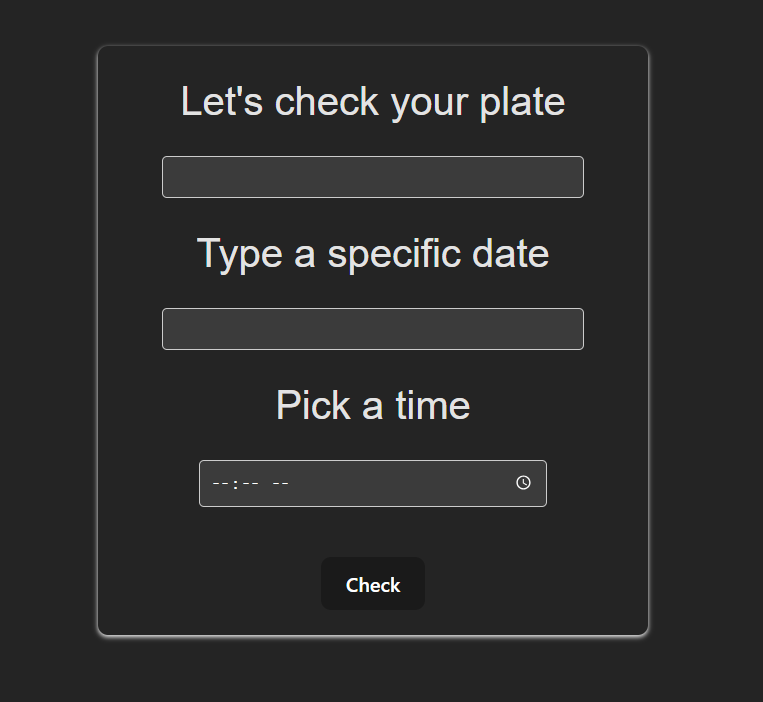

# Pico y Placa predictor
Web application to verify if your license plate has a traffic restriction due to the Pico y Placa regulation in Quito.

Quito DM has established a regulation that guarantees that only cars whose license plate meets a condition will be allowed to circulate during rush hours.
The regulation is as follows:
According to the last digit of the license plate vehicles will not be allowed to circulate from 7am to 9:30am and from 4 pm to 7:30pm.
1 or 2 Mondays
3 or 4 Tuesdays
5 or 6 Wednesday
7 or 8 Thursday
9 or 0 friday 

# Get started

Execute npm install to download dependencies
Execute npm run dev to start the application

# Functionality

The user will have to enter his license plate number, the date he wants to make the query with format 'DD/MM/YYYYY' and the time. If all 3 fields are completed correctly a pop up will indicate whether or not the license plate regulation applies or not.

# React + Vite

This template provides a minimal setup to get React working in Vite with HMR and some ESLint rules.

Currently, two official plugins are available:

- [@vitejs/plugin-react](https://github.com/vitejs/vite-plugin-react/blob/main/packages/plugin-react/README.md) uses [Babel](https://babeljs.io/) for Fast Refresh
- [@vitejs/plugin-react-swc](https://github.com/vitejs/vite-plugin-react-swc) uses [SWC](https://swc.rs/) for Fast Refresh
